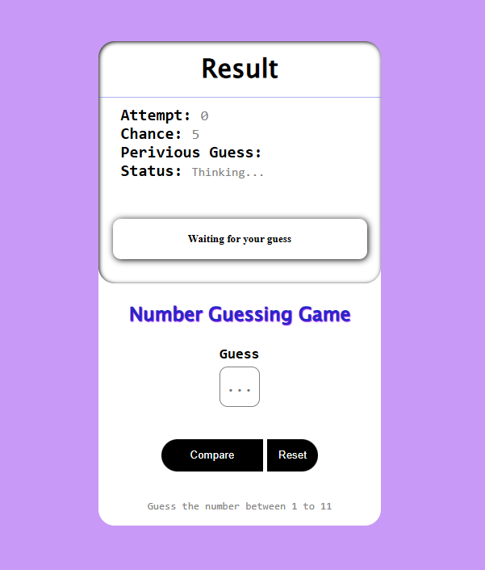

# Number Guessing Game

## Overview
The **Number Guessing Game** is a simple web-based game where the player attempts to guess a randomly generated number between 1 and 11. The player is given five chances to guess the correct number. The game provides feedback on each guess, indicating whether it is too high or too low.

## Features
- Random number generation between 1 and 11.
- User input field for guessing.
- Live feedback on whether the guess is too high or too low.
- Tracking of attempts, remaining chances, and previous guesses.
- Status indication of win/loss.
- Reset button to restart the game.

## Technologies Used
- **HTML**: Structure of the game.
- **CSS**: Styling for UI.
- **JavaScript**: Game logic and interactivity.

## Preview


## File Structure
```
/number-guessing-game
|-- index.html  # Main game file
|-- styles.css  # (Inline in index.html)
|-- script.js   # (Inline in index.html)
|-- preview.png # Preview image of the game
```

## Example Code

### HTML Structure
```html
<div id="main">
  <div id="result">
    <div id="ResultTitle">
      <h1>Result</h1>
    </div>
    <div id="details">
      <span class="info_view"><b>Attempt: </b></span>
      <span id="Attempt_Value" class="info_view">0</span><br />
      <span class="info_view"><b>Chance: </b></span>
      <span id="Chance_Value" class="info_view">5</span><br />
      <span class="info_view"><b>Previous Guess: </b></span>
      <span id="PG_Value" class="info_view">None</span><br />
      <span class="info_view"><b>Status: </b></span>
      <span id="Status_Value" class="info_view">Thinking...</span><br />
    </div>
    <div id="hint">
      <h5>Waiting for your guess</h5>
    </div>
  </div>
  
  <section id="title">
    <h3>Number Guessing Game</h3>
  </section>
  <section id="inputBox">
    <label id="lable01">Guess<br />
      <input type="text" id="inputFild" placeholder="..." />
    </label>
  </section>
  <section id="btn_box">
    <button id="btn">Compare</button>
    <button id="reset">Reset</button>
  </section>
  <p>Guess the number between 1 to 11</p>
</div>
```

### JavaScript Logic
```javascript
const btn = document.querySelector("#btn");
const resetBtn = document.querySelector("#reset");
const hint = document.querySelector("#hint");
let attempts = 0;
let chance = 5;
const computerGuess = Math.floor(Math.random() * 11) + 1;

btn.addEventListener("click", function () {
  let userGuess = Number(document.getElementById("inputFild").value);
  if (userGuess < 1 || userGuess > 11 || isNaN(userGuess)) {
    hint.textContent = "Invalid input! Enter a number between 1 and 11.";
    return;
  }
  attempts++;
  document.getElementById("Attempt_Value").textContent = attempts;
  document.getElementById("Chance_Value").textContent = 5 - attempts;
  document.getElementById("PG_Value").textContent = userGuess;
  
  if (userGuess > computerGuess) {
    hint.textContent = "Your guess is too high!";
  } else if (userGuess < computerGuess) {
    hint.textContent = "Your guess is too low!";
  } else {
    hint.textContent = `Congratulations! You guessed it right: ${computerGuess}`;
    document.getElementById("Status_Value").textContent = "Passed";
  }
  
  if (attempts === 5 && userGuess !== computerGuess) {
    hint.textContent = `Game Over! The number was ${computerGuess}`;
    document.getElementById("Status_Value").textContent = "Failed";
  }
});

resetBtn.addEventListener("click", function () {
  location.reload();
});
```

## How to Play
1. Enter a number between 1 and 11 in the input field.
2. Click the **Compare** button to check your guess.
3. The game will provide feedback if your guess is too high or too low.
4. You have **5 chances** to guess the correct number.
5. Click the **Reset** button to start over.

## Future you can Enhance
- Add animations and sound effects.
- Improve mobile responsiveness.
- Implement difficulty levels.
- Store game statistics in local storage.

## License
This project is open-source and free to use.

